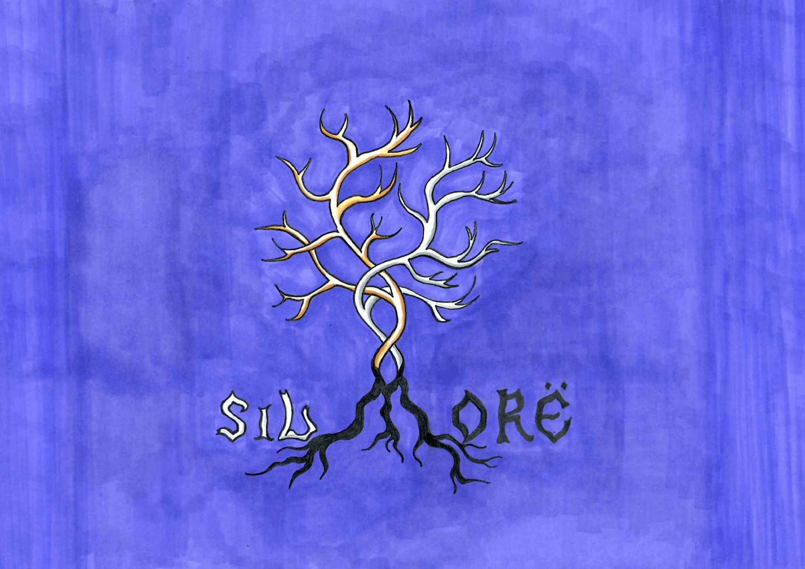

<p align="center">
  
</p>

# Sil-Morë

Sil-Morë — Shining Darkness is a version of SIL-Q built around two main ideas.
First, it adds characters and story material from Tolkien's First Age.
Second, it uses metaruns so consecutive runs are connected into one storyline, closer to modern roguelite games.

# Compiling (SDL3)

## Windows

### Prerequisites
- Git
- MSYS2 with MinGW64 (install from https://www.msys2.org/)
- CMake
- The repo SDL submodules under `external/`

### Build Order
1. Clone the repo and enter it.
   ```bash
   git clone https://github.com/k0rtesss/Sil-More.git
   cd Sil-More
   ```
2. Install MSYS2 and open the `MINGW64` terminal.
3. Install the known-good Windows build dependencies:
   ```bash
   pacman -S mingw-w64-x86_64-gcc mingw-w64-x86_64-cmake mingw-w64-x86_64-pkgconf mingw-w64-x86_64-SDL3 mingw-w64-x86_64-SDL3_image mingw-w64-x86_64-SDL3_ttf make
   ```
   This repo currently builds SDL from the pinned source submodules, but still relies on the MSYS2 toolchain and common image/font support libraries.
4. Initialize the pinned SDL submodules from the repo root:
   ```bash
   git submodule update --init --recursive
   ```
   `build-cmake.bat` does not fetch submodules for you.
5. From the repo root, run:
   ```powershell
   .\build-cmake.bat
   ```
   On the first successful run, this also configures and builds the SDL libraries from `external/`.
6. The script builds both Windows deployments:
   - `sil-more-windows-sdl3\sil-more.exe`
   - `sil-more-windows-sdl3-portable\sil-more.exe`
7. Run the build you want:
   ```powershell
   .\sil-more-windows-sdl3\sil-more.exe
   ```
   or
   ```powershell
   .\sil-more-windows-sdl3-portable\sil-more.exe
   ```

### Optional: package-based desktop build

This is a local convenience path only. Windows release builds should use the pinned submodules above.

```powershell
cmake -S . -B build -G "MinGW Makefiles" -DCMAKE_BUILD_TYPE=Release -DCMAKE_PREFIX_PATH=C:/msys64/mingw64 -DSIL_BUILD_WITH_SDL_SOURCES=OFF
cmake --build build --parallel
```

## Linux

### Prerequisites
- GCC or Clang compiler
- CMake
- SDL3 development libraries, including SDL3_image, SDL3_ttf, and SDL3_mixer

### Building
1. Install dependencies:
   - **Debian/Ubuntu:**
     ```bash
     sudo apt install build-essential cmake libsdl3-dev libsdl3-image-dev libsdl3-ttf-dev libsdl3-mixer-dev
     ```
   - **Fedora:**
     ```bash
     sudo dnf install gcc cmake SDL3-devel SDL3-image-devel SDL3-ttf-devel SDL3-mixer-devel
     ```
   - **Arch:**
     ```bash
     sudo pacman -S base-devel cmake sdl3
     paru -S sdl3_ttf sdl3_image sdl3_mixer # or use any other AUR helper
     ```

2. From the repo root, configure and build:
   ```bash
   cmake -B build -DCMAKE_BUILD_TYPE=Release
   cmake --build build --parallel
   ```
3. The executable will be in `build/sil-more`.
4. Run the game:
   ```bash
   ./build/sil-more
   ```

## macOS

macOS currently uses package-based SDL builds by default. The normal order is: install Apple's command line tools, install Homebrew packages, clone the repo, then build with CMake. The submodule path is still available as an alternative.

### Build Order (Default macOS Path)

#### 1. Install Apple's command line tools
Open Terminal.app and run:

```bash
xcode-select --install
```

If they are already installed, macOS will tell you. You can verify the install with:

```bash
xcode-select -p
```

That should print a path such as:

```text
/Library/Developer/CommandLineTools
```

#### 2. Install Homebrew
Homebrew is the easiest way to install the SDL3 libraries and CMake on macOS.

If you already have it, check with:

```bash
brew --version
```

If not, install it from https://brew.sh/ and then continue here.

#### 3. Install the build dependencies
In Terminal, run:

```bash
brew install cmake sdl3 sdl3-image sdl3-ttf sdl3-mixer
```

#### 4. Clone the repo
In Terminal, run:

```bash
git clone https://github.com/k0rtesss/Sil-More.git
cd Sil-More
```

#### 5. Build the game
From the repo root, configure and build against the Homebrew SDL packages:

```bash
cmake -S . -B build -DCMAKE_BUILD_TYPE=Release -DCMAKE_PREFIX_PATH="$(brew --prefix)"
cmake --build build --parallel
```

If CMake says it cannot find `SDL3`, `SDL3_image`, `SDL3_ttf`, or `SDL3_mixer`, try an explicit Homebrew prefix:

- Apple Silicon Macs usually use `/opt/homebrew`
- Intel Macs usually use `/usr/local`

Example:

```bash
cmake -S . -B build -DCMAKE_BUILD_TYPE=Release -DCMAKE_PREFIX_PATH=/opt/homebrew
cmake --build build --parallel
```

If you are on Apple Silicon and want a native arm64 build, use the normal Terminal/Homebrew setup, not a Rosetta shell.

#### 6. Run the game
From the repo root, run:

```bash
./build/sil-more
```

On first launch, the game will create its save/config folders in your macOS user data location and seed the default `sound.json` automatically.

### Alternative: build macOS against the repo SDL submodules
Use this only if you explicitly want the same source-based SDL path used by Windows and Android.

1. Clone the repo and enter it.
   ```bash
   git clone https://github.com/k0rtesss/Sil-More.git
   cd Sil-More
   ```
2. Initialize the SDL submodules:
   ```bash
   git submodule update --init --recursive
   ```
3. If you already configured `build/` for the Homebrew path and want to switch methods, remove the old build directory first.
4. Configure and build:
   ```bash
   cmake -S . -B build -DCMAKE_BUILD_TYPE=Release -DSIL_BUILD_WITH_SDL_SOURCES=ON
   cmake --build build --parallel
   ```
5. Run the game:
   ```bash
   ./build/sil-more
   ```

## Android

These instructions are for personal builds and sideloading. For normal play, prefer the published APK/release artifact when one is available.

### Prerequisites
- Git
- Android Studio
- Android SDK Platform 34 or newer
- Android NDK, CMake, and Platform-Tools from Android Studio's SDK Manager
- Java 17 or the Android Studio bundled JBR

### Personal APK build in Android Studio
1. Clone the repo and enter it.
   ```bash
   git clone https://github.com/k0rtesss/Sil-More.git
   cd Sil-More
   ```
2. Initialize the pinned SDL submodules:
   ```bash
   git submodule update --init --recursive
   ```
3. Install Android Studio plus the Android SDK, NDK, and CMake components from SDK Manager.
4. Open the `android/` folder in Android Studio.
5. Let Gradle sync complete.
6. Build or run the `app` configuration. The Gradle project packages the game data from `lib/` into the APK and targets `arm64-v8a`.

### Personal APK build from PowerShell
From the repo root, build a debug APK:

```powershell
.\build-android-apk.ps1 -Config Debug
```

Debug is the simplest choice for personal sideloading because Android signs it with the local debug key automatically. The APK is written to:

```text
android\app\build\outputs\apk\debug\app-debug.apk
```

To install it on a connected device, enable Developer options and USB debugging, accept the device authorization prompt, then run:

```powershell
.\install-android-apk.ps1 -Config Debug
```

To build, install, and launch in one step:

```powershell
.\deploy-android.ps1 -Config Debug -LaunchApp
```

If Android reports a signature mismatch with an older installed copy, uninstall the existing app first or reinstall with the same signing key. If the device has a newer local build installed, `.\install-android-apk.ps1 -Config Debug -AllowDowngrade` can be used for personal testing.

### Command-line Native Build
This builds only the native library through CMake and does not create an installable APK. Use it when debugging the native Android build:

```powershell
.\build-android.ps1 -Abi arm64-v8a -Config Release
```

### Play Store app bundle
This is not required for personal sideloading. For a Play Store app bundle, configure a release/upload keystore through `SIL_MORE_RELEASE_*` environment variables and run:

```powershell
.\build-android-bundle.ps1 -CompileSdk 35
```

For more Android-specific details, see [android/README.md](android/README.md).

# Steam Deck installation

- There is no separate Steam Deck release anymore. Use the regular Windows release zip.
- Long press power button and enter Desktop Mode.
- Download the latest Windows release zip from the Releases page.
- You can also copy it with removable storage and mount that in Desktop Mode.
- Unzip to any folder (Downloads works fine).
- Open Steam and in the top menu select Games -> Add a Non-Steam Game.
- Find `sil-more.exe` and add it. Change the name to Sil-More in Properties.
- In Properties -> Compatibility, use the current version of Proton.
- Optional: if the release includes `SteamDeck-Covers`, open Properties -> Customization and use the PNG files from that folder.
- Open controller setup. You should see the layout in Community layouts or search. If not, open `Steam-Deck-layout-Sil-More.url` in the game folder; the current link is `steam://controllerconfig/4068119597/3573052583`.
- Return back to Game mode and enjoy Sil-More!
